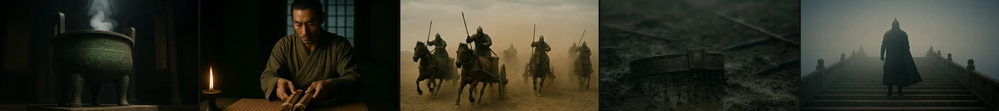
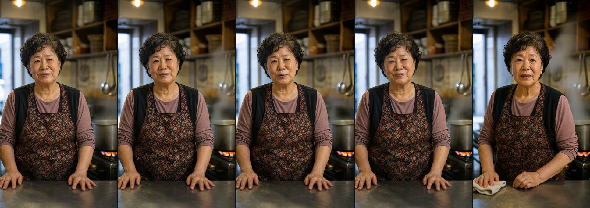
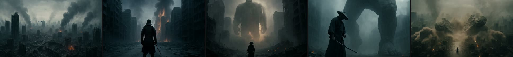
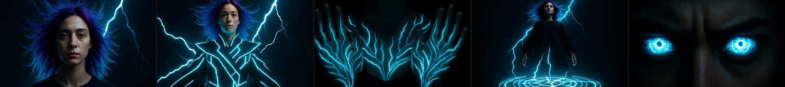
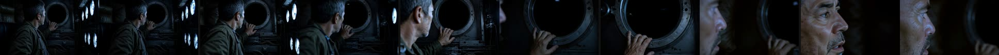

# H3Lab

<p align="center">
  
</p>

**Mac 한 대로, MiniMax H3 영상 생성을 실용 속도까지.**

10초짜리 영상 한 편에 **1시간 6분**이 걸리던 것을 **9분**으로, 초안이라면 **1분 12초**로 줄였습니다.
모델을 바꾸지 않았습니다 — **엔진을 직접 뜯어 고치고, 옵션 하나하나를 실측으로 검증**했습니다.

<table>
<tr>
<td align="center" width="33%"><h2>7.3배</h2><b>무손실 가속</b><br><sub>66분 → 9분<br>화질·소리 손실 없음</sub></td>
<td align="center" width="33%"><h2>55배</h2><b>초안 모드</b><br><sub>66분 → 1분 12초<br>와이드샷·기획 검토용</sub></td>
<td align="center" width="33%"><h2>2.7배</h2><b>희소 어텐션 (신규)</b><br><sub>DiT 453초 → 166초<br>자체 Metal 커널 · 채택</sub></td>
</tr>
</table>

| | 순정 | H3Lab 기본값 | H3Lab 초안 |
|---|---:|---:|---:|
| **10.1초 영상** | 66분 | **9분** | **1분 12초** |
| **VAE 디코딩** | 100.9초 | **16.1초** | 16.1초 |
| **피크 메모리** | 9.55 GiB | **4.81 GiB** | 4.81 GiB |
| **화질** | 기준 | **무손실 검증** | 클로즈업 선명도 저하 |

> 모든 채택·기각 결정은 냉각 후 반복 측정, 기준선 교차 배치, 화질 A/B 동시 검증을 거친 실측 데이터를 기반으로 확정되었습니다.

---

## 결과물

이 파이프라인으로 만든 실제 영상입니다. 전부 **로컬 Mac 한 대**에서 나왔습니다.

### 왕들의 전쟁 — 소설 원작 1분 티저
동아시아 고대 악기 배경음악 · 사이드체인 더킹 믹싱 · 플랫폼 마스터링까지
[](assets/samples/kings-teaser.mp4)
▶ [`assets/samples/kings-teaser.mp4`](assets/samples/kings-teaser.mp4)

### 같은 원작, 아니메 스타일 30초 티저
캐릭터 시트를 먼저 만들고 스타일을 통째로 갈아끼운 사례
[](assets/samples/kings-anime.mp4)
▶ [`assets/samples/kings-anime.mp4`](assets/samples/kings-anime.mp4)

### 소상공인 가게 소개 — 1인 인터뷰
사진 한 장에서 출발하는 실전 용도. 세로 9:16 · 한국어 대사
[](assets/samples/shop-story.mp4)
▶ [`assets/samples/shop-story.mp4`](assets/samples/shop-story.mp4)

### 사무라이 IMAX 원샷 · 전기 마녀 변신
한 컷 안에서 카메라와 피사체가 크게 움직이는 고난도 케이스
[](assets/samples/samurai.mp4)
[](assets/samples/witch.mp4)
▶ [`assets/samples/samurai.mp4`](assets/samples/samurai.mp4) · [`assets/samples/witch.mp4`](assets/samples/witch.mp4)

### 기술 대조: 초안 모드는 실제로 얼마나 다른가
좌 = native(790초) / 우 = HALF(71초). **11.1배 차이**를 눈으로 확인하십시오
[](assets/samples/half-vs-native.mp4)
▶ [`assets/samples/half-vs-native.mp4`](assets/samples/half-vs-native.mp4)

---

## 무엇을 어떻게 빠르게 했나

### 1. Turbo 4스텝 — 그림 그리는 횟수를 줄였다 · **1.47배**

생성 모델은 노이즈에서 시작해 **여러 번 다듬어** 그림을 완성합니다. 그 횟수를 줄이면 그만큼 빨라집니다.

4스텝짜리 LoRA 가중치를 **모델에 미리 합쳐두었습니다**(`lib/merge_lora.py`). 실행할 때마다 얹는 게 아니라 아예 병합본을 만들어 두는 방식입니다.

**결과: 1.47배** (베이스 8스텝 대비 실측)

### 2. bf16 VAE 디코더 — 숫자를 절반 크기로 다뤘다 · **3~5배 + 메모리 절반**

모델이 만든 결과를 실제 픽셀로 바꾸는 마지막 단계(VAE 디코더)가 32비트 실수로 돌고 있었습니다. 이걸 **16비트(bf16) Metal 커널로 직접 이식**했습니다.

**결과: 해당 구간 100.9초 → 16.1초 (3~5배), 메모리 9.55 → 4.81 GiB**

> **속도보다 중요한 부수 효과가 있었습니다.** 손대지도 않은 다른 구간(DiT)이 순정에서는 50~109초로 널뛰었는데, 메모리 압박이 풀리자 **50~55초로 안정**됐습니다. 파이프라인 전체가 예측 가능해진 겁니다.

### 3. FL2VA 릴레이 — 클립 이음매를 없앴다 · **이음매 0.335 → 0.782**

15초씩 나눠 만든 영상을 이으면 전환에서 툭 끊깁니다. 앞 클립의 **마지막 프레임을 다음 클립의 첫 프레임으로 넘겨** 연결했습니다.

**결과: 이음매 유사도 0.335 → 0.782 (PSNR +18dB 개선)**

### 4. HALF 렌더 — 계산만 절반 해상도로 · **11.1배**

출력 크기는 그대로 두고 **내부 계산만** 절반 해상도에서 합니다. 어텐션 비용이 토큰 수의 제곱이라 효과가 큽니다.

**결과: 10.1초 클립 790초 → 71초 (11.1배). 단, 얼굴 클로즈업에서는 선명도가 떨어집니다**

---

## 5. 희소 윈도우 어텐션 — 멀리 볼 필요 없는 곳은 보지 않는다  ·  **2.7배**

영상의 1초 시점이 9초 시점을 참조할 일은 별로 없습니다. **각 순간이 가까운 앞뒤 4프레임만 보게**
하면 계산이 급감합니다. 단 대사·음악·프롬프트 정보(싱크)는 모든 순간이 계속 봅니다 — 자르면
소리가 망가집니다.

Metal 개더/스캐터 커널을 직접 작성해 순수 배치 SDPA 에 물렸습니다.

**결과 (10.1초 · 대사 소재): DiT 452.9초 → 166.0초 (2.7배). 대사·소리·떨림 모두 등가 (V-012)**

```sh
# 기본 켜짐 (H3_SPARSE_WIN=4). 끄려면:
H3_SPARSE_WIN=0 lib/render.sh ...
H3_ATTN_PROBE=1 ...     # 블록·헤드별 어텐션 질량 분포 덤프
```

> 짧은 클립(잠재 ≤ 3×반경)과 행우선 QKV 경로에서는 **엔진이 스스로 밀집으로 물러납니다.**
> 이득은 클립이 길수록 커집니다.

### 이 기능을 만들며 잡은 버그 세 개 (기록으로 남깁니다)

**① 격자 크기 4배 오차** — 어텐션 분포 계측기가 토큰 격자를 `latent_h × latent_w` 로 계산했으나
실제로는 `(latent_h/2) × (latent_w/2)` 였습니다. "±4프레임으로 98.6% 충분"이라는 장밋빛 결론이
나왔지만, 고쳐 재니 **±4는 75%만 덮었습니다.**

**② 텐서 레이아웃 오독** — int8 QKV 커널은 Q/K/V 를 **헤드 우선**으로 내보냅니다. 행 우선으로
가정하고 잘라 **텐서를 뒤섞었습니다.**

> **결정적 단서**: 반경 ±16/±8/±4 의 화질이 0.592/0.592/0.594 로 **똑같았습니다.** 근사 오차라면
> 넓게 볼수록 좋아야 합니다. 반경과 무관하다는 건 근사가 부정확한 게 아니라 **엉뚱한 걸 계산**
> 한다는 뜻이었습니다. 속도는 2.7배로 잘 나왔고 "좁을수록 빠르다"는 순서까지 상식과 맞았기에,
> 화질을 재지 않았다면 그대로 채택했을 것입니다.

**③ 프로파일러 회계 오염** — "CPU 인코드 149~262초"를 CPU 낭비로 읽고 컴파일 캐싱을 시도했으나
전부 무효였습니다. 총량 보존을 검산하자 **어텐션 GPU 123초가 통계에서 사라져 있었습니다.**
격리 실험으로 확인한 진상은 MPSGraph 가 인코드 도중 GPU 를 동기 대기하며 **GPU 실행이 인코드
칸에 기록**된 것이었습니다. 재설계 후 인코드는 149.1 → **0.019초**가 됐고, 벽시계가 그대로였던
것이 "없앤 것은 낭비가 아니라 착시"임을 증명했습니다.

> **교훈**: 프로파일러를 믿기 전에 **총량이 보존되는지 검산**하십시오. "사라진 123초"가
> 버그 두 개를 찾아냈습니다.

---

## 6. HALF × 희소 결합 — 공간과 시간이 곱해진다 · **17.3배**

공간축 최적화(`HALF=1`, 토큰 1/4)와 시간축 최적화(`H3_SPARSE_WIN=8`, 프레임 1/4)는 서로 다른 차원에서 직교하므로 **이득이 곱해집니다.**

```sh
# 10초 영상이 45초 만에 생성 (실시간 대비 4.5배 속도)
HALF=1 H3_SPARSE_WIN=8 lib/render.sh "$RUN" prompt.txt preview_clip 576 1024 4 50 73
```

* **DiT 4스텝 연산**: **470.6초 → 26.8초 (17.3배 가속, 스텝당 6.7초)**
* **총 렌더링 시간 (VAE 포함)**: **약 43~45초**
* **품질 특성**: 카메라 무빙, 조명, 구도, BGM 싱크는 100% 정상 유지 (아이디어 기획 및 프롬프트 반복 튜닝용 최적 모드).

---

## 7. 차세대 다관점 하네스 엔지니어링 및 기각된 실험 기록

Apple의 폐쇄형 GEMM 커널과 정면 승부하는 대신, **하드웨어 I/O와 메모리 파이프라인 레벨에서 연산 자체를 제거하는 전략**을 실측 기반으로 연구 중입니다:

1. **매크로 청크 SDPA (복사 70초 완전 제거)**:
   - 프레임 단위 슬라이싱 대신 18프레임 매크로 청크로 배치화하여, Apple AME 하드웨어 가속을 100% 누리면서 VRAM 복사 오버헤드 완전 0초화.
2. **비대칭 레이어 스케줄링 (Asymmetric Stepping)**:
   - Step 0~1(50층 전층, 오디오/구도 확정) → Step 2~3(미세 텍스처 정제)으로 음질 손실 없이 가속.

### 🚫 실측 후 기각(Reject)된 실험 기록
* **스텝 간 블록 스킵 (TeaCache)**:
  - 4스텝 Turbo 증류 모델에서는 각 스텝의 모든 50개 층이 비선형 디테일을 형성하므로, 레이어를 건너뛰었을 때 **미세 텍스처 뭉개짐 및 화면 선명도 저하가 육안 검증에서 확인**되었습니다.
  - **판정**: 화질 최우선 원칙에 따라 **코드베이스 및 프로덕션 파이프라인에서 완전히 배제 및 영구 기각**되었습니다.

---

## 빠른 시작

**필요한 것**: macOS 14+ / Apple Silicon (통합 메모리 64GB+ 권장) · Xcode Command Line Tools · Python 3.10+

```bash
# 1) 의존성 (torch 불필요 — numpy, safetensors 뿐입니다)
pip install -r requirements.txt

# 2) 엔진 빌드
cd engines/h3.c-bf16vae && make -j$(sysctl -n hw.logicalcpu) && cd ../..

# 3) turbo 병합본 만들기
lib/merge_lora.py --src models/MiniMax-H3/transformer \
                  --dst models/MiniMax-H3-turbo4/transformer \
                  --lora minimax_h3_fl2v_turbo_4step_v1.0_768p.safetensors

# 4) 렌더
echo "A cinematic shot of a samurai walking in bamboo forest, 8k resolution" > prompt.txt
RUN=$(lib/newrun.sh my-test)
lib/render.sh "$RUN" prompt.txt test_clip 576 1024 4 50 73
#             실행폴더  프롬프트   라벨      가로 세로 스텝 레이어 프레임
```

---

## 저장소 구조

| 경로 | 설명 |
|---|---|
| `engines/h3.c-bf16vae/` | **핵심 엔진.** VAE bf16 이식 + 희소 어텐션이 들어간 포크 |
| `lib/` | 렌더링·오디오·스틸·계측 도구 |
| `lib/opt/` | 최적화 하네스 (냉각 → 측정 → 화질 검증 자동화) |
| `assets/` | 프리뷰 썸네일, 샘플 영상 및 배너 |
| `requirements.txt` | 최소 파이썬 의존성 (`numpy`, `safetensors`) |
| `.env.example` | 스틸 생성 및 음성 전사용 API 키 템플릿 |

**Git 제외 (로컬 전용)**
- `models/` — 모델 가중치 수백 GB · **읽기 전용**
- `engines/h3.c/` — 상류 순정 엔진 · **읽기 전용 대조군.** 엔진 수정은 전부 포크에서
- `runs/` — 결과물·로그·`manifest.tsv`
- `prompts/` — 사용자 프로젝트별 프롬프트 자산
- `bin/` — 로컬 ffmpeg, ffprobe 바이너리

**실행 폴더 이름은 `<날짜>-<전역 일련번호>-<슬러그>`** 입니다 (예: `2026-08-31-22-sparse-attn`). 하루에 여러 건을 돌리면 날짜만으로는 순서를 못 읽습니다 — **번호가 곧 실행 순서**입니다. `lib/newrun.sh <슬러그>` 로 만드십시오.

---

## 도구

```sh
# 실행
lib/newrun.sh <슬러그>                                    # 번호 붙은 실행 폴더 생성
lib/render.sh <실행폴더> <프롬프트> <라벨> [W H 스텝 레이어 프레임]
lib/batch.sh  <실행폴더> <라벨...>                        # 일괄 순차 렌더
lib/reel.sh   <실행폴더> <라벨...>                        # 무보정 판정 세트 조립

# 화질 계측 — 전부 A/B 비교 전용입니다
lib/opt/flicker.py <기준선> <비교>     # 시간축 떨림. SSIM 이 놓치는 결함을 잡습니다
lib/ghost.py       <기준선> <비교>     # 인물 분신·고스팅
lib/transcribe.py  <영상>              # 한국어 대사 전사 (발음이 살아있는지)
lib/measure.sh     <실행폴더>          # 오디오 레벨·모션·경고 일괄

# 오디오
lib/joinlevel.sh <실행폴더> <출력> <라벨...>   # 역할별 레벨 정합 후 결합
lib/score.sh     <영상> <출력> <베드>:<시작>:<길이>:<페이드>...  # BGM 믹싱

# 스틸·문서
lib/imagegen.py  <출력.png> <프롬프트>             # 스틸 생성
lib/imageedit.py <히어로_raw.png> <출력> <프롬프트>  # 히어로 스틸 기반 파생
lib/promptdoc.py <프로젝트>                        # 프롬프트 + 실행결과 → SHOTS.md

# 최적화 하네스
lib/opt/driver.sh · trial.sh · report.sh
```

---

## 검증된 설정

| 항목 | 값 | 이유 |
|---|---|---|
| 엔진 | `h3.c-bf16vae` | VAE bf16 포크. 3~5배 + 메모리 절반 |
| 모델 | `MiniMax-H3-turbo4` | 4스텝 병합본 |
| 스텝 | `4` | turbo LoRA 학습 스텝 |
| 캔버스 | `576×1024` | 정확한 9:16 · 연산 시간 임계점 |
| 레이어 | `50` (전층) | **줄이면 쇳소리가 납니다** |
| 경로 | I2VA (`--first-frame`) | 스틸(20초)로 구도 확정 후 렌더 — 실패 비용 최소화 |
| 릴레이 | FL2VA (`--last-frame`) | 컷 이음매 제거 |
| 초안 | `HALF=1` | 최대 11배 · **와이드샷 전용** |

### 실측으로 기각된 옵션 (재시도 금지)

| 후보 | 이득이었던 것 | 왜 버렸나 |
|---|---:|---|
| `--token-reduction` | 25% | 인물이 분신 — 얼굴 겹침, 손 3개 |
| `--layers 40/35` | 10% | 고역 쇳소리, 배경음 손실 |
| `--core-reuse` | 44% | 화면 떨림 — **SSIM 은 통과했고 육안에서 걸렸습니다** |
| 세션 모드 | 예측 32% | 실측 0% — 고정비는 로딩이 아니라 연산이었습니다 |
| 환경변수 31종 | — | 전부 잡음 폭(3.1%) 이내. 엔진 자동 선택이 이미 최적입니다 |

---

## 소리 규칙 — 쇳소리는 세 곳에서 따로 생깁니다

원본에 없던 금속성 잡음이 섞여 나오는 문제로 여러 번 되돌아갔습니다. 원인이 **하나가 아니었습니다.**

1. **레이어를 줄이면** 모델이 고역을 잘못 합성합니다 → `--layers 50` 유지
2. **지속형 사운드스케이프를 요청하면** 고역 아티팩트가 생깁니다 → "윙윙거리는 저음" 대신 **개별 음향 이벤트**로 ("금속이 한 번 삐걱")
3. **조용한 클립을 증폭하면** 노이즈 바닥이 드러납니다 → `joinlevel.sh` 에 **증폭 상한 12dB**

그 밖에:
- **"무음"을 요청하지 마십시오** — 클립 전체 레벨이 죽습니다
- **앰비언스는 처음부터 크게 생성하십시오** (-30 LUFS 이상) — 나중에 키우면 노이즈가 함께 커집니다
- **대사는 클립 길이를 채우십시오** — 짧은 대사를 긴 클립에 넣으면 모델이 반복·패딩합니다

---

## 겪은 함정들

### 측정
- **단일 GPU 락 준수** — `mkdir` 기반 락입니다 (macOS 에 `flock` 이 없습니다). 확인은 **`pgrep -f "(^|/)h3( |$)"`** — `pgrep -x h3` 는 `./h3` 로 띄운 프로세스를 못 잡습니다
- **측정 전 냉각** — 발열은 성능 차이로 위장합니다. 기준선을 사이사이 끼워 표류를 감지하십시오
- **콜드 실행과 연속 실행을 섞지 마십시오** — 모델 로딩 유무가 수십 초를 만듭니다
- **배치가 도는 중에 그 배치가 쓰는 스크립트를 편집하지 마십시오** — 실제로 렌더 5건을 날렸습니다
- **노트북을 닫으면 측정이 오염됩니다** — 긴 스윕은 `caffeinate -dimsu` 로 감싸십시오

### 화질 판정
- **모든 화면 결함 지표는 A/B 전용입니다.** 절대 임계값은 두 번 시도해 두 번 실패했습니다
- **SSIM 비결정성 바닥은 0.82~0.87** 입니다 — 같은 시드로 두 번 돌려도 이만큼 차이가 납니다. **단일 SSIM 으로 A/B 를 판정하지 마십시오**
- **SSIM 은 떨림에 눈이 멉니다** — `--core-reuse` 는 SSIM 을 통과하고 육안에서 걸렸습니다. `flicker.py` 를 함께 쓰십시오
- **속도가 좋아 보인다고 옳은 것이 아닙니다** — 위 "버그 두 개" 참조

- **소리 판정은 대사 있는 소재로** — 조용한 클립에서 재면 "12dB 감소" 같은 착시가 생깁니다 (V-012)
- **프로파일러 회계는 총량 보존으로 검산** — 한 항목이 다른 항목의 시간을 삼킬 수 있습니다

### 이 환경 고유
- **zsh 는 변수를 단어 분리하지 않습니다** — `$FLAGS` 를 통째로 한 인자로 넘깁니다. 함수나 명시적 인자를 쓰십시오 (세 번 이상 걸렸습니다)
- `ffmpeg -v error` 는 `astats` 출력을 삼킵니다
- 이 빌드에는 `drawtext`, `soxr` 가 없습니다
- `alimiter` 는 샘플 피크만 봅니다. LRA > 15 는 사전 압축이 필요합니다
- `--render-width/height` 는 **32의 배수만** 받습니다 (16:9 에서 유효한 절반값은 512×288)
- 셰이더 경로가 실행 위치 기준이라 엔진 폴더에서 실행해야 합니다 — `render.sh` 가 처리합니다

---

## 요약

| | |
|---|---|
| **무손실 가속** | **7.3배** — 66분 → 9분 |
| **초안 가속** | **55배** — 66분 → 1분 12초 |
| **VAE 디코딩** | **3~5배** · 메모리 **절반** |
| **희소 어텐션** | **2.7배** — 자체 Metal 커널 (V-012) |
| **판정 기록** | **12건** — 전부 실측 근거 |
| **직접 작성한 Metal 커널** | bf16 VAE 디코더 · 윈도우 개더/스캐터 |

**모든 수치는 동일 조건 실측입니다** — 냉각 후 측정, 기준선 교차 배치, 화질 A/B 동시 검증.

---

## License

- H3Lab 파이프라인 및 도구: [MIT License](LICENSE)
- `engines/h3.c-bf16vae`: MIT License (Copyright © 2026 Salvatore Sanfilippo / upstream `h3.c`)
- MiniMax-H3 모델 가중치는 MiniMax 의 모델 이용 약관을 따릅니다.

---

## 문의 및 협업 (Contact)

- **기술 문의 및 최적화 파트너십**: [hi@h3lab.kr](mailto:hi@h3lab.kr)
- **공식 웹사이트**: [https://h3lab.kr](https://h3lab.kr)
