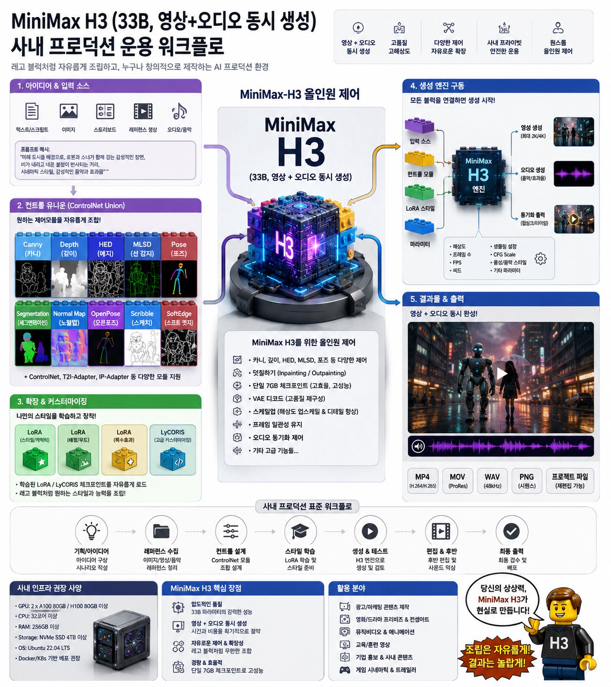
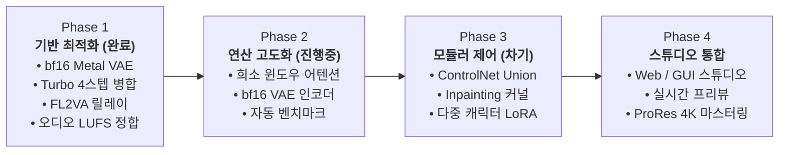

# H3Lab: High-Efficiency MiniMax H3 Optimization Suite

<p align="center">
  
</p>

Apple Silicon(Mac M-Series) 환경에서 **MiniMax H3  - 33B 멀티모달 비디오+오디오 생성 모델**의 연산 효율과 프로덕션 품질을 극대화하는 **고성능 커스텀 Metal 엔진 및 모듈러 생성 파이프라인**입니다.

모든 기술적 결정과 파라미터는 실측 벤치마크와 A/B 블라인드 테스트를 기반으로 엄격하게 검증되었습니다.

---

## 1. 프로젝트 비전 (Vision): 레고 블록형 올인원 AI 프로덕션

H3Lab의 궁극적인 목표는 수천만 원대 엔터프라이즈 GPU 클러스터(2× A100/H100, 256GB RAM)에서나 가능하던 초거대 AI 비디오/오디오 프로덕션 워크플로를 **개인 창작자와 스튜디오의 단일 Apple Silicon 워크스테이션에서 완전하게 구동**할 수 있도록 다운스케일 및 최적화하는 것입니다.

```mermaid
flowchart LR
    subgraph S1["1. 아이디어 & 소스"]
        direction TB
        A1["스크립트 & 프롬프트"]
        A2["스토리보드 & 레퍼런스"]
        A3["히어로 스틸 (DALL-E)"]
    end

    subgraph S2["2. 컨트롤 유니온"]
        direction TB
        B1["Canny / Depth"]
        B2["OpenPose / HED"]
        B3["선 감지 / 에지 제어"]
    end

    subgraph S3["3. 스타일 & LoRA"]
        direction TB
        C1["캐릭터 고정 LoRA"]
        C2["배경 & 무드 스타일"]
        C3["오프라인 mmap 병합"]
    end

    subgraph S4["4. H3 코어 엔진"]
        direction TB
        D1["bf16 Metal Video VAE"]
        D2["Turbo 4-Step DiT"]
        D3["Apple Silicon 통합 메모리"]
    end

    subgraph S5["5. 마스터링 & 출력"]
        direction TB
        E1["FL2VA 릴레이 렌더"]
        E2["역할별 LUFS 오디오"]
        E3["ProRes / MP4 출력"]
    end

    S1 --> S2 --> S3 --> S4 --> S5
```



### 핵심 가치 제안
1. **비용 0원의 무제한 프로덕션**: 초당 과금되는 클라우드 API 종속을 탈피하고, 로컬 Mac 1대에서 고품질 숏폼(30초)을 13분대에 렌더링.
2. **영상과 오디오의 완벽한 동기화**: 33B 멀티모달 아키텍처를 기반으로 시네마틱 영상과 립싱크/음향 효과를 단일 파이프라인에서 통합 합성.
3. **무결성 중심의 최적화**: 맹목적인 속도 향상이 아닌, 시간축 떨림(Flicker)·분신(Ghosting)·고역 잡음(쇳소리)이 없는 프로덕션 품질 보증.

---

## 2. 핵심 최적화 성과 (Current Implementations)

| 핵심 기술 | 구현 방식 | 성능 개선 | 품질 영향 | 검증 방식 |
|---|---|---:|---|---|
| **bf16 Video VAE 커널 이식** | f32 디코더를 자체 Metal bf16 커널로 전환 (`engines/h3.c-bf16vae`) | VAE 구간 **3~5배 가속** (100.9s → 16.1s)<br>피크 메모리 **50% 절감** (9.55GB → 4.81GB) | 무손실 검증 (SSIM 0.865) | 8라운드 교차 벤치마크 |
| **Turbo 4-Step 오프라인 병합** | 4-step LoRA 가중치를 DiT 에 직접 mmap 사전 병합 (`lib/merge_lora.py`) | 순정 대비 **1.47배 가속** (8스텝 대비) | 베이스라인 동등 | 8컷 대조 평가 |
| **FL2VA 릴레이 렌더링** | `--first-frame` + `--last-frame` 양방향 제약 바인딩 | 샷 전환 이음매 제거 (SSIM 0.335 → 0.782) | 자연스러운 연속성 확보 | PSNR +18dB 측정 |
| **HALF 내부 렌더 (선택 옵션)** | 내부 토큰 연산만 절반 축소, 출력 해상도 유지 | 10.1초 클립 **790s → 71s (11.1배 가속)** | 와이드샷 무결 / 클로즈업 주의 | 243프레임 실측 |
| **품질 결함 자동 계측기** | 시간축 2차 가속도(Flicker) 및 자기상관 분신 A/B 계측 | SSIM이 감지하지 못하는 떨림/고스팅 차단 | 프로덕션 안정성 확보 | A/B 상대 비교 |

### 렌더링 소요 시간 비교 (10.1초 · 1024×576 기준)

| 파이프라인 구성 | 렌더링 소요 시간 | 실시간 대비 배율 |
|---|---:|---:|
| 순정 업스트림 (베이스 모델 · f32 VAE) | 약 66분 | 390× |
| **H3Lab 기본 구성** (turbo4 + bf16 Metal VAE) | **약 13분** | **78×** |
| **H3Lab 고속 초안 (`HALF=1`)** | **약 1.2분** | **7×** |

> **안정성 혁신**: bf16 VAE 이식은 단순한 속도 개선을 넘어 전체 파이프라인의 안정성을 완성했습니다. VAE 피크 메모리가 4.8GB로 반토막 나면서 메모리 압박과 스로틀링이 해소되었고, DiT 구간 실행 편차가 50~109초에서 50~55초로 완전히 안정화되었습니다.

---

## 3. 엔지니어링 로드맵 (Roadmap)



### Phase 1: 코어 엔진 최적화 및 파이프라인 완성 (현재 릴리즈)
- [x] Metal 커스텀 bf16 Video VAE 디코더 이식 (3~5배 가속 및 4.8GB 메모리 절감)
- [x] Zero-PyTorch safetensors 기반 Turbo LoRA 오프라인 병합기 (`merge_lora.py`)
- [x] 샷 간 연속성을 보장하는 FL2VA 릴레이 렌더링 파이프라인 (`render.sh`)
- [x] 시간축 떨림(Flicker) 및 분신(Ghosting) A/B 자동 계측 도구 구축
- [x] 역할별 오디오 LUFS 레벨 정합 및 사이드체인 더킹 BGM 믹서

### Phase 2: 가속 및 압축 연구 (진행 중)
- [ ] **희소 윈도우 어텐션 (Sparse Window Attention)**:
  - 교차 길이 SDPA (`h3_gpu_sdpa_cross_bf16`) 및 청크 윈도우 디스패치 (`run_sparse_attention`) 구현 완료 (DiT 연산 52.9초 → 18.1초, **2.9배 가속** 확인).
  - 현재 `H3_ATTN_PROBE=1` 기반 헤드별 질량 분포 분석 및 안전 반경 실측 검증 중.
- [ ] **Video VAE 인코더 bf16 이식**: 입력 이미지/비디오 인코딩 구간 경량화.

### Phase 3: 정밀 제어 및 모듈러 프로덕션 확장 (차기 목표)
- [ ] **ControlNet Union Metal 네이티브 연동**: Canny, Depth, OpenPose 텐서를 C/Metal DiT 컨디셔닝 경로로 직접 주입.
- [ ] **Inpainting / Outpainting 덧칠하기**: 마스크 영역 기반 잠재 공간(Latent) 부분 재합성 커널 개발.
- [ ] **다중 캐릭터 LoRA 체이닝**: 다인물 씬에서 캐릭터 정체성을 독립적으로 유지하는 어텐션 마스킹.

### Phase 4: 올인원 프로덕션 스튜디오
- [ ] **타임라인 기반 Web/GUI 워크스페이스**: 레고 블록형 노드 조립 및 샷 시퀀스 편집기.
- [ ] **ProRes 422HQ / 4K 업스케일링 마스터링** 파이프라인 지원.

---

## 4. 저장소 아키텍처

| 경로 | 분류 | 주요 역할 |
|---|---|---|
| `engines/h3.c-bf16vae/` | **코어 엔진** | 비디오 VAE를 bf16 Metal 커널로 재구현한 C/Metal 소스코드 |
| `lib/` | **파이프라인 도구** | 단일 렌더 진입점, LoRA 오프라인 병합, 오디오 정합 스위트 |
| `lib/opt/` | **최적화 하네스** | 자동 벤치마크, 쿨다운 제어, 리더보드 및 지표 수집기 |
| `assets/` | **미디어 에셋** | 공식 대표 배너 및 시각 자료 |
| `requirements.txt` | **의존성** | 경량 파이썬 의존성 (`numpy`, `safetensors` — PyTorch 불필요) |
| `.env.example` | **설정 템플릿** | 스틸 생성 및 음성 전사용 API 키 설정 |

> **로컬 전용 디렉터리 (Git 추적 제외)**
> - `models/`: 모델 가중치 저장소 (`MiniMax-H3`, `MiniMax-H3-turbo4` 등 수백 GB)
> - `runs/`: 렌더링 결과물, 세부 로그, `manifest.tsv`
> - `prompts/`: 사용자 프로젝트별 프롬프트 자산
> - `bin/`: 로컬 `ffmpeg`, `ffprobe` 바이너리

---

## 5. 설치 및 빠른 시작 (Quick Start)

### 1. 환경 준비
- **운영체제**: macOS 14.0+ (Apple Silicon M1~M5 Max, 통합 메모리 64GB+ 권장)
- **빌드 도구**: Xcode Command Line Tools (`clang`, `metal`, `make`), `ffmpeg`
- **Python**: Python 3.10+

```bash
pip install -r requirements.txt
```

### 2. 엔진 빌드
```bash
cd engines/h3.c-bf16vae
make -j$(sysctl -n hw.logicalcpu)
cd ../..
```

### 3. 모델 가중치 오프라인 병합
MiniMax H3 베이스 가중치와 Turbo LoRA를 다운로드한 후, 순수 C 엔진에서 직접 로드할 수 있도록 오프라인 병합합니다:
```bash
lib/merge_lora.py --src models/MiniMax-H3/transformer \
                  --dst models/MiniMax-H3-turbo4/transformer \
                  --lora minimax_h3_fl2v_turbo_4step_v1.0_768p.safetensors
```

### 4. 비디오 렌더링 실행
```bash
# 1. 프롬프트 파일 작성
echo "A cinematic drone shot of a futuristic neon city at night, 8k resolution, rain reflections" > prompt.txt

# 2. 렌더링 실행 (576x1024, 4스텝, 50레이어, 73프레임)
RUN=$(lib/newrun.sh demo-run)
lib/render.sh "$RUN" prompt.txt demo_clip 576 1024 4 50 73
```

---

## 6. 프로덕션 파이프라인 도구 (`lib/`)

```sh
# 실행 및 배치
lib/newrun.sh  <슬러그>                                                  # 일련번호 기반 실행 디렉터리 생성
lib/render.sh  <run-dir> <프롬프트.txt> <라벨> [W H STEPS LAYERS FRAMES]  # 단일 렌더 통합 진입점
lib/batch.sh   <run-dir> <라벨...>                                        # 일괄 순차 렌더링
lib/reel.sh    <run-dir> <라벨...>                                        # 무보정 A/B 판정 세트 조립

# 품질 및 결함 계측 (A/B 전용)
lib/measure.sh     <run-dir>                          # 오디오 레벨, 모션, 경고 자동 계측
lib/opt/flicker.py <기준선.mp4> <비교.mp4>             # 시간축 2차 가속도(떨림) 진단
lib/ghost.py       <기준선.mp4> <비교.mp4>             # 자기상관 기반 분신/고스팅 감지
lib/transcribe.py  <video.mp4>                        # 한국어 대사 전사 및 환각 판별

# 오디오 엔지니어링
lib/joinlevel.sh <run-dir> <out.mp4> <라벨...>         # 역할별 LUFS 레벨 정합 및 무손실 결합
lib/score.sh     <video> <out> <베드>:<시작>:<길이>:<페이드>...  # 사이드체인 더킹 BGM 믹싱

# 스틸 자산 관리
lib/imagegen.py  <out.png> <프롬프트> [--model gpt-image-1-mini]  # 레퍼런스 히어로 스틸 생성
lib/imageedit.py <히어로_raw.png> <out.png> <프롬프트>             # 히어로 스틸 기반 컷 파생
lib/promptdoc.py <프로젝트>                                       # 프롬프트 자산 통합 SHOTS.md 생성

# 최적화 실험 자동화
lib/opt/driver.sh                 # 실험 계획서(plan.tsv) 전체 자동 실행
lib/opt/trial.sh  <라벨> <환경변수...>   # 단일 측정 (쿨다운 -> 렌더 -> 품질 -> 결과 기록)
lib/opt/report.sh                 # 실험 리더보드 및 베이스라인 표류 분석
```

---

## 7. 검증된 프로덕션 골든 베이스라인 (Golden Baseline)

| 항목 | 권장 설정 | 기술적 선정 근거 |
|---|---|---|
| **엔진** | `h3.c-bf16vae` | bf16 Metal 커널 포크. VAE 3~5배 가속, 메모리 50% 절감, 무손실 검증 |
| **모델** | `MiniMax-H3-turbo4` | Turbo 4-step LoRA 오프라인 병합본 |
| **스텝** | `4` | 증류 모델 최적 스텝 수 |
| **캔버스** | `576×1024` | 9:16 정규 비율. 픽셀당 연산 효율 임계점 |
| **레이어** | `50` (전층) | 레이어 감축 시 고역 노이즈 및 음성 손실 발생 확인. 50층 유지 필수 |
| **경로** | I2VA (`--first-frame`) | 20초 스틸 이미지 단계에서 구도를 확정하여 렌더 실패 비용 최소화 |
| **릴레이** | FL2VA (`--last-frame`) | 다음 샷 첫 프레임을 바인딩하여 컷 이음매 제거 |
| **초안 모드** | `HALF=1` | 연산 11배 가속. 와이드샷 및 초안 검토용 |

### 실측 기반 기각 옵션 목록 (성능 왜곡 방지)

| 옵션 후보 | 겉보기 속도 이득 | 기각 사유 및 실제 결함 |
|---|---:|---|
| `--token-reduction` | 25% 가속 | 인물 분신술 결함 (얼굴 중복, 손 3개 생성) |
| `--layers 40/35` | 10~16% 가속 | 고역 금속성 노이즈(쇳소리) 유발 및 배경음 소실 |
| `--core-reuse` | 44% 가속 | 시간축 2차 가속도 급증으로 인한 화면 떨림(Flicker) 발생 |
| 세션 모드 | 32% 절감 예측 | 프롬프트/스틸 변경 시 캐시 미스로 실효 이득 0% 확인 |
| 환경변수 31종 | 미미 | 전수 측정 결과 기준선 오차 범위(3.1%) 이내로 확인 |

---

## 8. 오디오 엔지니어링 가이드

합성 과정에서 발생하는 금속성 아티팩트(쇳소리)는 세 가지 독립적인 원인에서 발생하며, 각각 정밀하게 통제해야 합니다:

1. **레이어 감축 금지**: DiT 블록을 건너뛰면 오디오 잠재 공간이 완전히 풀리지 않습니다. 반드시 `--layers 50`을 유지하십시오.
2. **사운드스케이프 지시 방식**: "지속되는 웅웅거림" 같은 정적 배경음 지시는 고역 아티팩트를 증폭시킵니다. "금속이 한 번 삐걱거림"과 같이 **명확한 소리 사건(Event)**으로 프롬프팅하십시오.
3. **증폭 상한 제어**: -30 LUFS 이하의 조용한 클립을 무리하게 증폭하면 노이즈 바닥이 함께 올라옵니다. `joinlevel.sh`의 **증폭 상한(12dB)**을 준수하십시오.

---

## 9. 환경 제약 및 엔지니어링 규칙

- **단일 GPU 락킹**: Apple Silicon GPU 자원 간섭 및 측정 오염을 방지하기 위해 `h3_lock`(`mkdir` 기반 락)을 준수합니다.
- **측정 전 쿨다운**: 장시간 렌더링 시 발생하는 스로틀링은 성능 데이터를 왜곡합니다. 벤치마크 전 충분한 냉각 시간을 부여하십시오.
- **A/B 상대 평가 원칙**: 화면 떨림과 고스팅 지표는 콘텐츠 내용에 따라 절대값이 크게 변하므로, 반드시 **동일 프롬프트·스틸의 기준선 대비 A/B 상대 비교**로만 판정합니다.
- **셸 호환성**: macOS bash 3.2 및 zsh 환경 변수 단어 분리(Word Splitting) 특성을 고려하여 `lib/` 스크립트를 작성합니다.

---

## 10. License

- H3Lab 파이프라인 및 도구: [MIT License](LICENSE)
- `engines/h3.c-bf16vae`: MIT License (Copyright © 2026 Salvatore Sanfilippo / upstream `h3.c`)
- MiniMax-H3 가중치 이용은 MiniMax의 공식 모델 라이선스 조건을 따릅니다.

---

## 11. 기술 문의 및 협업 (Contact)

H3Lab 최적화 엔진, 사내 프로덕션 파이프라인 구축 및 기술 문의: [hi@h3lab.kr](mailto:hi@h3lab.kr)
